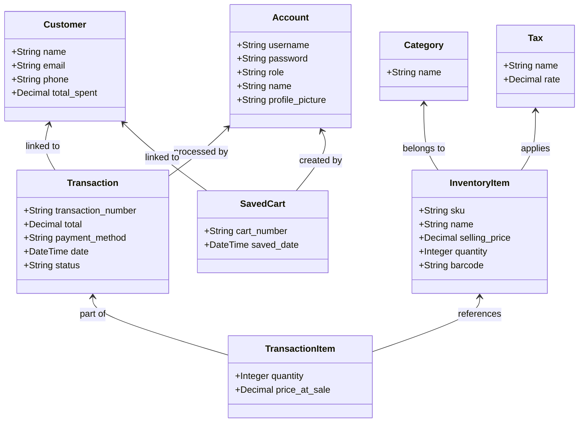
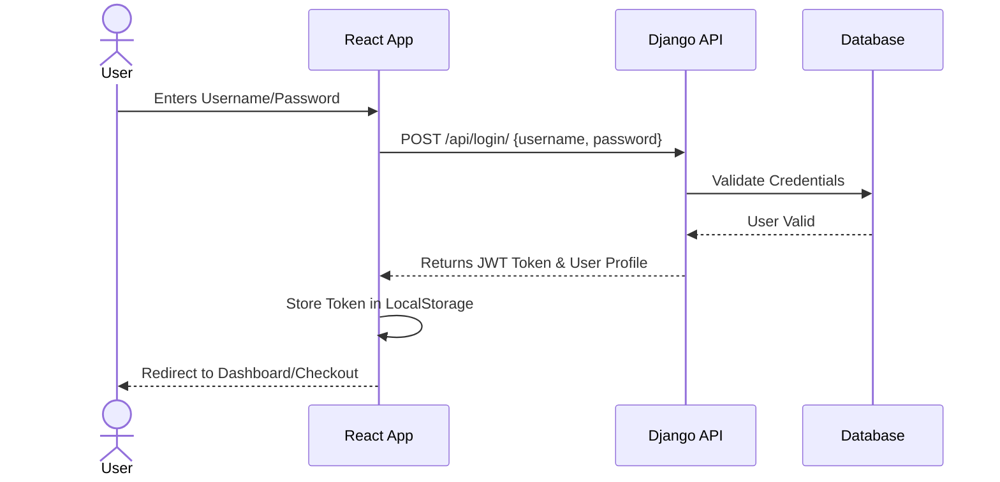
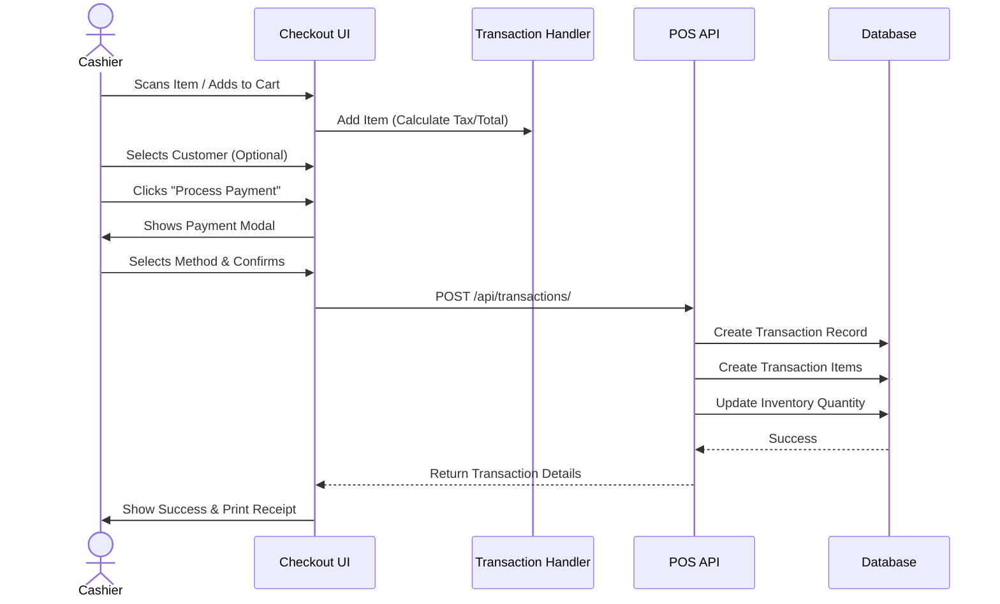
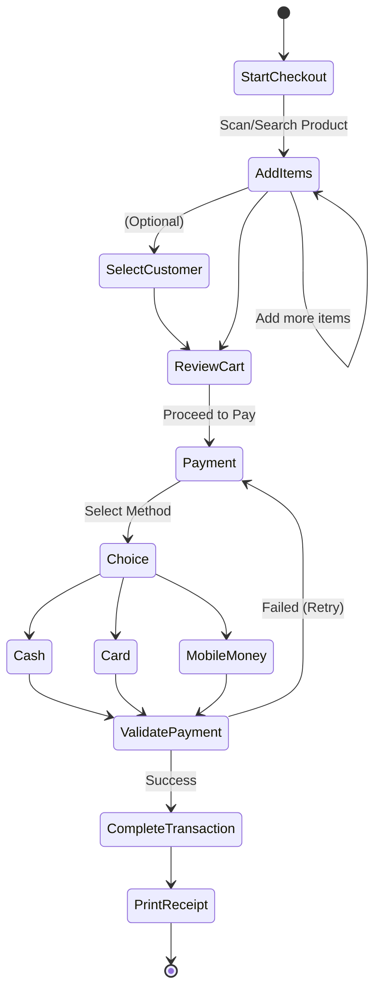

# UML Diagrams

This document contains Unified Modeling Language (UML) diagrams representing the system's structure and behavior.

## 1. Class Diagram
Represents the database schema and relationships between entities.



## 2. Sequence Diagrams

### 2.1. Authentication Flow
Interaction between User, Frontend, and Backend during login.



### 2.2. Sale Transaction Flow
Process of completing a sale.



## 3. Activity Diagram (Checkout Process)
Workflow logic for the cashier during checkout.



## 4. Use Case Diagram
High-level system capabilities by user role.

```mermaid
usecaseDiagram
    actor Admin
    actor Cashier
    actor Manager

    package "POS System" {
        usecase "Manage Inventory" as UI1
        usecase "Manage Accounts" as UI2
        usecase "View Analytics" as UI3
        usecase "Process Sale" as UI4
        usecase "View Transactions" as UI5
        usecase "Manage Customers" as UI6
    }

    Admin --> UI2
    Admin --> UI1
    Admin --> UI3
    Admin --> UI6

    Manager --> UI1
    Manager --> UI3
    Manager --> UI6
    Manager --> UI5

    Cashier --> UI4
    Cashier --> UI5
    Cashier --> UI6
```
